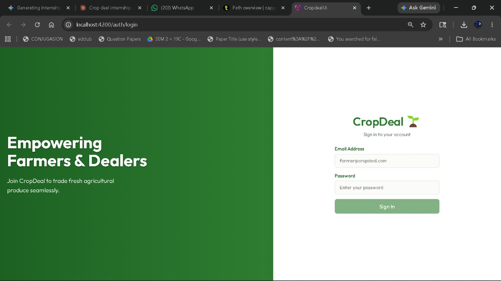
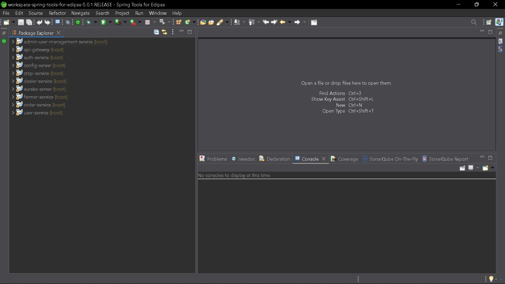
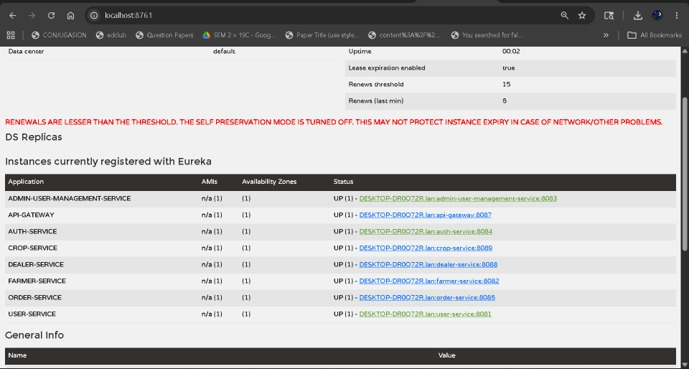
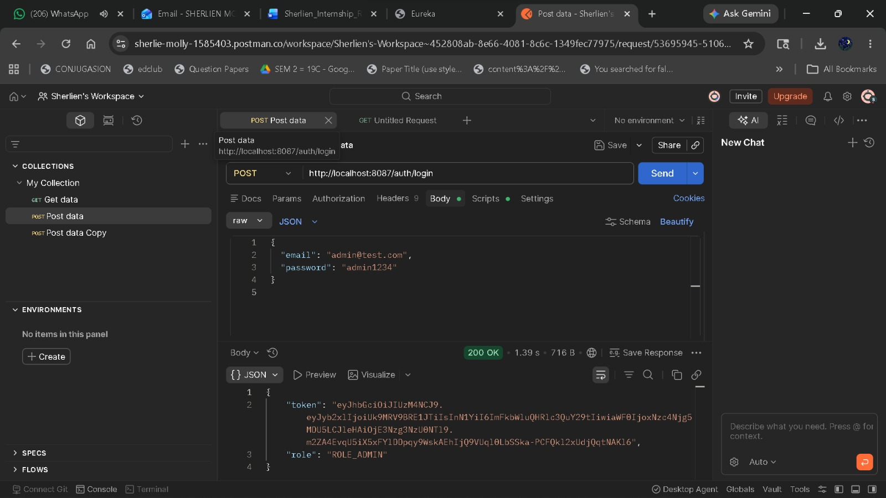
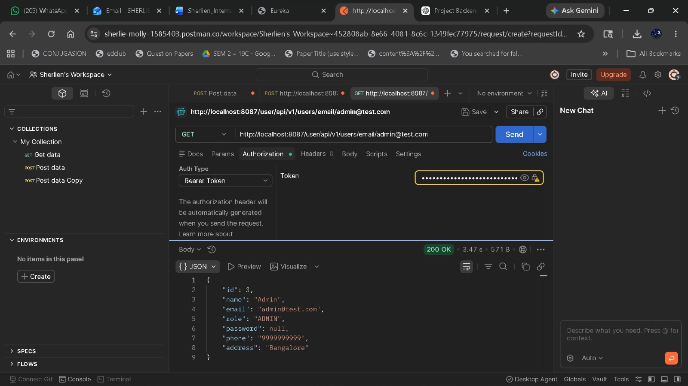
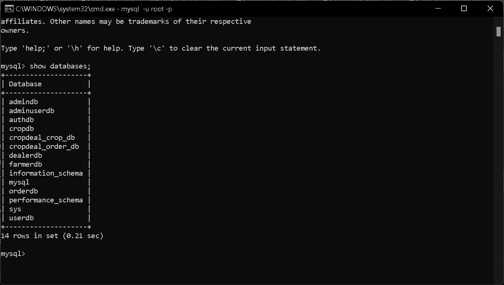

# CropDeal - Project Documentation

## Project Overview

CropDeal is a microservices-based agricultural marketplace that connects farmers and dealers for seamless crop trading.

### Technology Stack

* Java 17
* Spring Boot
* Spring Security + JWT
* Eureka Server
* OpenFeign
* API Gateway
* MySQL
* Angular

### Microservices

* Authentication Service
* User Service
* Farmer Service
* Dealer Service
* Crop Service
* Order Service
* Admin Management Service
* API Gateway
* Eureka Server

---

## Application Login

---

## Running Microservices

---

## Eureka Service Discovery

---

## JWT Authentication

---

## Secured API Access

---

## MySQL Databases

---

## Features

* JWT Authentication & Authorization
* Service Discovery using Eureka
* API Gateway Routing
* Inter-Service Communication using OpenFeign
* Role-Based Access Control
* Crop Listing and Management
* Order Management
* Angular Frontend Integration

## Author

Sherlien Molly D

